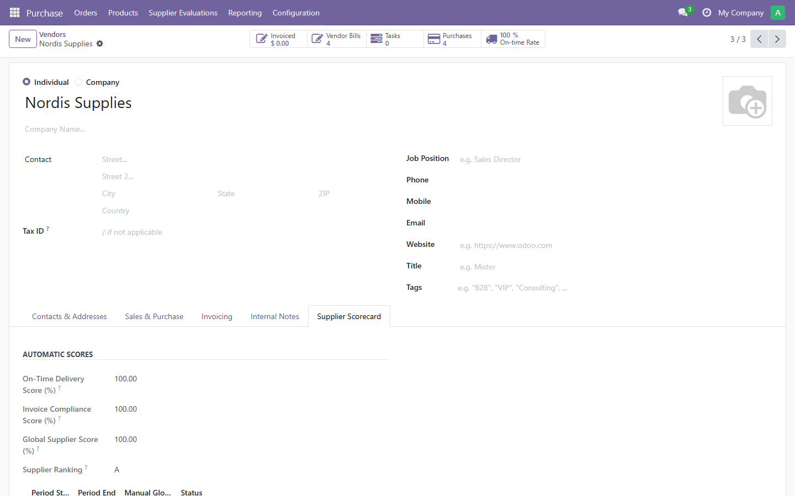
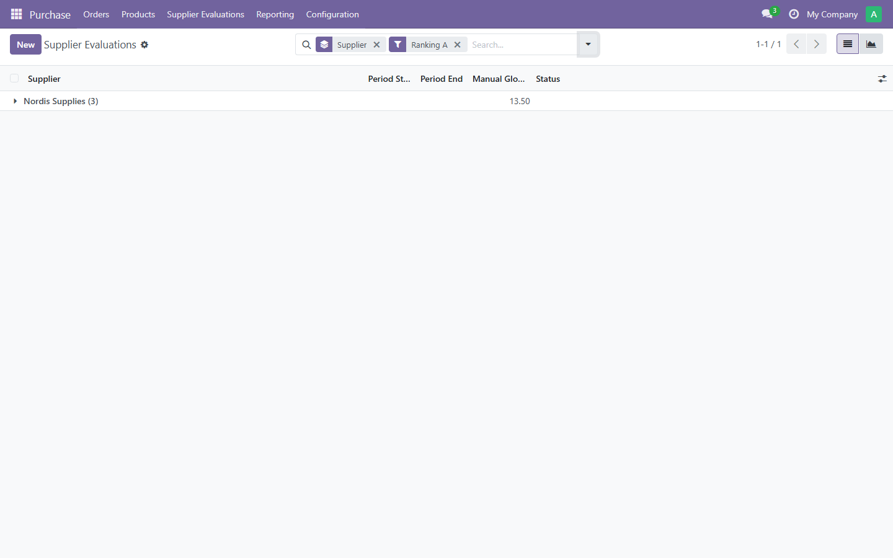
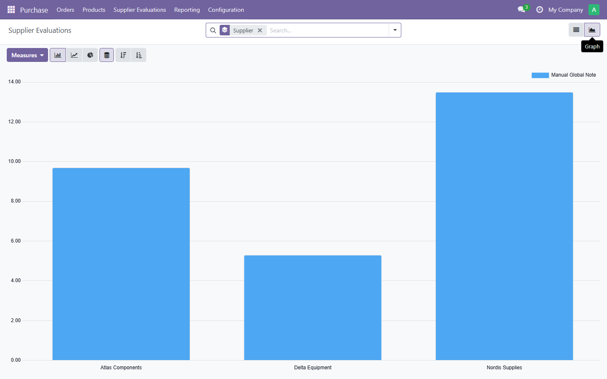

# Purchase Supplier Scorecard

Automatic and manual supplier performance scoring for Odoo 18 Purchase.

## Description

This module extends the standard Purchase app to evaluate vendors on
their actual performance instead of relying on subjective judgment
alone. It computes two objective scores from transactional data
(on-time delivery and invoice accuracy), combines them into a
configurable weighted global score, and assigns an automatic A / B / C
/ Not Evaluated ranking. Buyers can complement this automatic score
with a periodic manual evaluation covering quality, responsiveness and
price competitiveness.

## Features

- **On-time delivery score**: percentage of incoming receipts
  completed on or before their scheduled date.
- **Invoice compliance score**: percentage of purchase orders whose
  posted vendor bills match the order's untaxed amount, without
  discrepancy.
- **Global supplier score**: weighted average of the two scores above,
  with weights configurable per company in Purchase Settings.
- **Automatic ranking**: A, B, C or Not Evaluated, derived from the
  global score.
- **Manual supplier evaluation**: a new model to record periodic
  ratings (quality, responsiveness, price) with a draft, validated,
  closed workflow. Only one validated evaluation is allowed per
  supplier and per period.
- **Dedicated views**: a Supplier Scorecard tab on the vendor form, and
  list, form, search and graph views for evaluations, with filters and
  groupings by ranking and by period.
- **Security**: a dedicated "Supplier Evaluation" group (inheriting
  Purchase user rights) and multi-company record rules.
- **Scheduled recomputation**: a nightly scheduled action refreshes
  every supplier's scores as a safety net.

## Screenshots

**Supplier Scorecard tab on the vendor form** — automatic scores and
ranking, computed from real purchase and invoicing data.



**Supplier Evaluations, filtered by ranking** — the search view's
built-in Ranking A/B/C/Not Evaluated filters.



**Graph view** — manual global note by supplier, for a quick visual
comparison.



## Installation

1. Copy the `purchase_supplier_scorecard` folder into your Odoo 18
   custom addons directory.
2. Update the apps list (Apps > Update Apps List).
3. Search for "Purchase Supplier Scorecard" and install it.

The module depends on `purchase` and `purchase_stock`. Both are part
of Odoo 18 Community.

## Configuration

1. Go to **Purchase > Configuration > Settings**.
2. In the **Supplier Scorecard** section, set the relative weights for
   the on-time delivery and invoice compliance scores. Weights do not
   need to sum to 100; they are normalized automatically.
3. Assign the **Supplier Evaluation** group (Settings > Users) to the
   buyers who should record and validate manual evaluations.

## Usage

- Open any vendor's contact form and check the **Supplier Scorecard**
  tab for its automatic scores, ranking and evaluation history.
- Go to **Purchase > Supplier Evaluations** to record a new periodic
  evaluation, validate it once complete, and close it at the end of
  its period.

## Compatibility

Odoo 18.0, Community and Enterprise editions. The module only depends
on Community modules (`purchase`, `purchase_stock`) and does not
require any Enterprise app.

## Running the tests

With a database prepared for testing:

```
odoo-bin -d <database> -i purchase_supplier_scorecard --test-enable --stop-after-init
```

Or, to run only this module's tests against an existing installation:

```
odoo-bin -d <database> -u purchase_supplier_scorecard --test-enable --test-tags /purchase_supplier_scorecard --stop-after-init
```

## License

LGPL-3. See the `LICENSE` file for the full text.

## Author

Khadija Lahlou
Portfolio: https://khadija-portfolio-nine.vercel.app/
GitHub: https://github.com/KHADIJALAH
